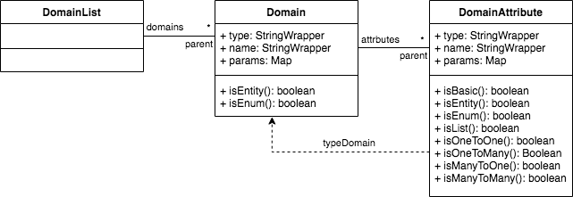
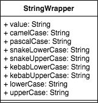

# Model DSL

## **Table of contents**

### 1. [**About**](#about)
### 2. [**Model DSL Syntax**](#model-dsl-syntax)
### 3. [**StringWrapper Class**](#stringwrapper-class)
### 4. [**Usage**](#usage)
### 5. [**Practical Case**](#practical-case)

## About

Model DSL is a domain-specific language that generate meta-data from the input code that representing a certain model created by the user.
This meta-data can be entities, enumerations and relationship, as the following picture.



There is a variety of applicability for the Model DSL, among them we highlight:
- Diagrams generation
- Reports generation
- Codes gereration

> At the end we will show a small practical case of how to make a ASCII class diagram generator with the Model DSL

## Model DSL Syntax

To generate the model above, the user needs to write his code according to the syntax below.

Entity declaration:

```bash
entity <entity-name> [(parameter [, parameter ... ])] {
  <field-list>  
}
```

Enumeration declaration:

```bash
enum <enum-name> {
  <ENUM_NAME> 
  [<ENUM_NAME> ...]
}
```

Field declaration:

```bash
<field-type> <field-name> [(parameter [, parameter ... ])]
```

Parameter declaration:

```bash
<parameter-name>: '<parameter-value>'
```

Field type declaration (can be lowercase):

```bash
String | Integer | Long | Double | Float | Boolean | Number | Date | DateTime | List
```

### Entity example

```bash
entity User (table: 'SYSTEM_USER') {
    String name (label: 'Name', required: 'true')
    String login
    String password (encode: 'true')
    Integer age
    Boolean active
}
```

### Enumeration example

```bash
enum Country {
  BRAZIL
  FRANCE
  BELGIUM
  ITALY
}
```

### Relationship example

To relate the entities and enumerations we can use the typing of the fields. See the examples:

```bash
entity Country {
    String name
    Double size
    List<State> staties
}

entity State {
    String name
    Country country
    Region region
}

enum Region {
    NORTH
    NORTHEAST
    MIDWEST
    SOUTHEAST
    SOUTH
}
```

We can use the field parameter flags `manyToOne` and `manyToMany` to define other relationship types. See the examples:

```bash
entity Book  {
    String title
    String description
    List<Author> authors (manyToMany: 'true')
}

entity Author {
    String name
    List<Book> books (manyToMany: 'true')
}
```

## StringWrapper Class

All string attributes in the metadata are of type StringWrapper, a class that implements various methods for text treatment.



| attribute          | Example     | 
|--------------------|-------------|
| **camelCase**      | helloWorld  |
| **pascalCase**     | HelloWorld  |
| **snakeLowerCase** | hello_world |
| **snakeUpperCase** | HELLO_WORLD |
| **kebabLowerCase** | hello-world |
| **kebabUpperCase** | HELLO-WORLD |
| **lowerCase**      | helloworld  |
| **upperCase**      | HELLOWORLD  |

## Usage

To use the Model DSL, just configure the dependency in the maven file

```
<repository>
    <id>model-dsl</id>
    <url>https://raw.github.com/rdabotelho/mvn-repo/model-dsl/</url>
</repository>
```

```
<dependency>
    <groupId>com.m2r</groupId>
    <artifactId>model-dsl</artifactId>
    <version>1.0.0</version>
</dependency>
```

Create a source code file with your modeling, as the following example:

_my-test.model_
```bash
entity Message {
  String text
  Level level
}

enum Level {
  DEBUG
  INFO
  WARN
  ERROR
}
```

Use the method `parse` from the class `ModelDsl` to generate metadata with your model (as shown in the top figure diagram).

```java
String filePath = "my-test.model";
try (Reader reader = new FileReader(filePath)) {
    DomainList metadata = ModelDsl.parse(reader);
    
    // Here you can generate everything you want
    metadata.getDomains().forEach(domain -> {
        System.out.println("Entity or Enum: " + domain.getName());
    });
        
} 
catch (IOException e) {
    e.printStackTrace();
}
```

## Practical Case

This practical case show a Java code that generates a simple ASCII class diagram with the Model DSL

```java
package com.m2r.mdsl;

import com.m2r.easyparser.ParserException;
import com.m2r.mdsl.model.DomainList;

public class ClassDiagram {

    public static void main(String[] args) throws ParserException {
        final String code =
                "entity User {" +
                "   String login" +
                "   String password" +
                "}";

        DomainList metadata = ModelDsl.parse(code);
        
        System.out.println(String.format("+%24s+", " ").replace(" ", "-") );
        metadata.getDomains().forEach(domain -> {
            System.out.println(String.format("| %-22s |", domain.getName()));
            System.out.println(String.format("+%24s+", " ").replace(" ", "-") );
            domain.getAttributes().forEach(attribute -> {
                System.out.println(String.format("| %-10s: %-10s |", attribute.getName(), attribute.getType()));
            });
        });
        System.out.println(String.format("+%24s+", " ").replace(" ", "-") );
    }

}
```

The result will be the following ASCII

```bash
+------------------------+
| User                   |
+------------------------+
| login     : String     |
| password  : String     |
+------------------------+
```